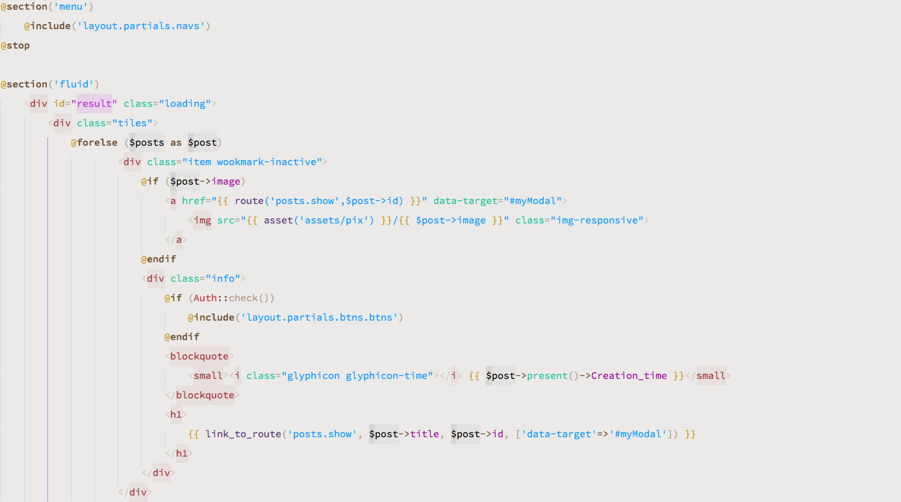

# Yeti_UX

[](https://packagecontrol.io/packages/Yeti_UX/)

Yeti Improved Scheme/Syntax-HL for ST.

## Supported Syntax

```text
SublimeLinter
GitGutter
MarkDown (& MarkDown Extended)
diff
MakeFile
Ruby
Python
JSON, XML
JS, Coffee
Html, Jade
Css, Less, Sass/Scss
PHP, Laravel Blade, SQL
```

## Extended Support

Check [ctf0/Seti_UX#2](https://github.com/ctf0/Seti_UX/issues/2).

## Previews

**HTML**


**BLADE**



**PHP**


**DIFF**


**JADE**


**PYTHON**


**MARKDOWN**


**JSON** (up-to 19 level)


**XML**


## ToDO

* [ ] Better support for AngularJs (need some help with regex for scopes).
* [ ] Better support for Sass/Scss. (we need a better syntax definition ,more like "Less" ).
* [ ] Better support for Python.
